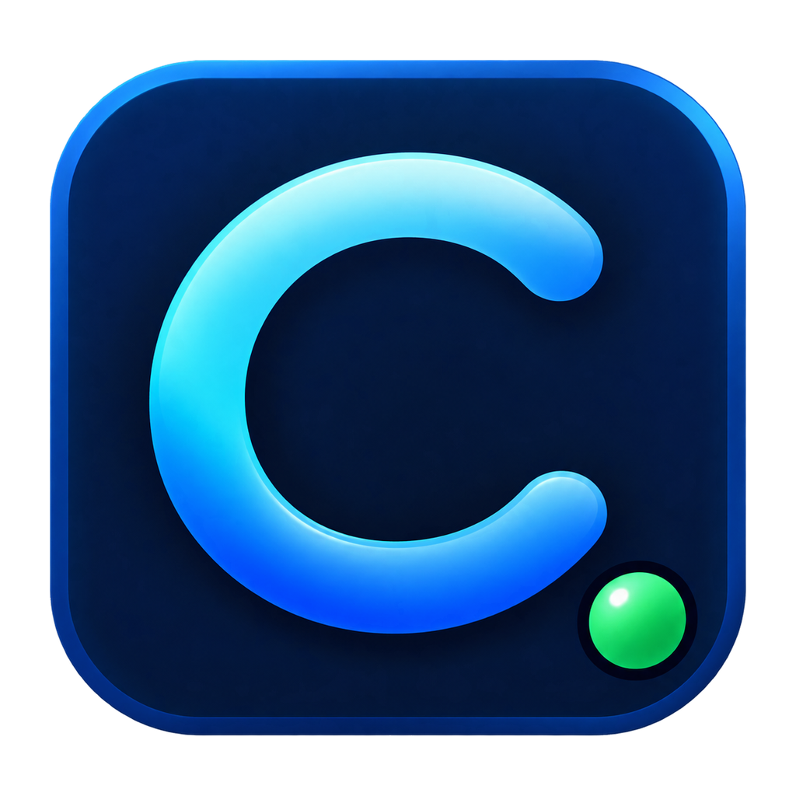

# Codex Usage Widget

<p align="center">
  
</p>

<p align="center">
  A compact Windows desktop widget that shows your remaining Codex usage and reset countdown in near real time.
</p>

<p align="center">
  <a href="#中文">中文</a> · <a href="#english">English</a>
</p>

> [!IMPORTANT]
> This is an independent community project. It is not an official OpenAI product and is not affiliated with or endorsed by OpenAI.

## 中文

### 功能

- 原生 .NET 8 WPF 悬浮卡片，紧凑状态约 `180 × 52`，鼠标移入自动展开详情。
- 启动后立即查询，并每 15 秒通过本机 `codex app-server --stdio` 主动校准额度。
- 显示所有可用额度窗口、剩余百分比、周期、重置时间、实时倒计时和 Credits。
- app-server 不可用时自动回退到本机 Codex 会话日志，并明确标注数据来源。
- 支持拖动、始终置顶、托盘隐藏、手动刷新和当前用户开机启动。
- 无需 API Key，不读取、复制或保存 Codex 登录凭据。

### 安装

1. 打开仓库右侧的 [Releases](../../releases/latest)。
2. 下载 `CodexUsageWidgetSetup.exe`，双击安装。
3. 安装完成后，桌面和系统托盘会出现 Codex 用量插件。

安装器面向 `win-x64`，安装到当前用户的 `%LOCALAPPDATA%\Programs\CodexUsageWidget`，无需管理员权限。它会从目标电脑已有的 Codex 桌面版或 CLI 中复制并验证 app-server helper；若缺少 .NET 8 Desktop Runtime，则从微软官方下载到插件自己的安装目录。

> [!WARNING]
> 当前 Release 未进行商业代码签名，Windows SmartScreen 可能显示“Windows 已保护你的电脑”。请只从本仓库 Release 下载，核对 Release 中的 SHA256 文件后再选择“更多信息 → 仍要运行”。

静默安装：

```powershell
CodexUsageWidgetSetup.exe /Q
```

可在“设置 → 应用”中卸载，或运行安装目录中的：

```powershell
wscript.exe LaunchWidget.vbs --uninstall
```

### 实时刷新与隐私

插件使用当前 Windows 用户已有的 Codex 登录状态，启动独立且隐藏的本机 app-server 子进程，并调用实验性接口 `account/rateLimits/read`。额度每 15 秒主动校准，收到额度更新通知时会提前刷新，倒计时每秒更新。

插件不会读取、复制、保存或上传 API Key、令牌和登录文件，也不会自行实现账号登录。实时查询失败时，它只读取 `%USERPROFILE%\.codex\sessions` 与 `archived_sessions` 中最近的 `rate_limits` 事件；旧数据会标记为“日志回退”，不会冒充实时数据。

### 构建与测试

要求 Windows 10/11、.NET 8 SDK 和 PowerShell：

```powershell
dotnet restore CodexUsageWidget.sln
dotnet build CodexUsageWidget.sln -c Release --no-restore
dotnet run --project tests\CodexUsageWidget.Tests -c Release --no-build
PowerShell -ExecutionPolicy Bypass -File scripts\build-installer.ps1
```

离线测试不需要 Codex 账户。真实 app-server 集成测试仅用于本机验收：

```powershell
dotnet run --project tests\CodexUsageWidget.Tests -c Release --no-build -- --live
```

### 兼容性限制

- 主动查询依赖实验性 Codex app-server 协议，当前在 Codex CLI `0.147.0` 上验证；未来协议变化可能需要更新。
- “实时”表示启动立即查询、事件通知刷新和最长约 15 秒的周期校准，不是持续连接的服务端仪表盘。
- 首版仅支持当前 Windows 用户和 `win-x64`，不支持多账号、自动更新和代码签名。

## English

### Features

- Native .NET 8 WPF floating card. It stays compact at about `180 × 52` and expands on hover.
- Queries the local `codex app-server --stdio` immediately at startup and recalibrates every 15 seconds.
- Displays every available limit window, remaining percentage, window duration, reset time, live countdown, and Credits.
- Falls back to local Codex session logs when app-server is unavailable and clearly labels the data source.
- Supports dragging, always-on-top, tray hide/restore, manual refresh, and opt-in startup for the current user.
- Requires no API key and never reads, copies, or stores Codex login credentials.

### Install

1. Open the repository's [latest Release](../../releases/latest).
2. Download and run `CodexUsageWidgetSetup.exe`.
3. The widget will appear on the desktop and in the system tray after installation.

The `win-x64` installer installs per-user to `%LOCALAPPDATA%\Programs\CodexUsageWidget` without administrator access. It copies and validates the app-server helper from the Codex Desktop app or CLI already installed on the target PC. If .NET 8 Desktop Runtime is missing, the installer downloads it from Microsoft into the widget's own installation directory.

> [!WARNING]
> Releases are not commercially code-signed, so Windows SmartScreen may warn before launch. Download only from this repository, verify the provided SHA256 file, then choose **More info → Run anyway** if you trust the release.

Silent install:

```powershell
CodexUsageWidgetSetup.exe /Q
```

Uninstall from **Settings → Apps**, or run this from the installation directory:

```powershell
wscript.exe LaunchWidget.vbs --uninstall
```

### Live refresh and privacy

The widget reuses the current Windows user's existing Codex login state. It starts its own hidden local app-server process and calls the experimental `account/rateLimits/read` method. Usage is recalibrated every 15 seconds and earlier when update notifications arrive; countdowns update once per second.

The widget does not read, copy, store, or upload API keys, tokens, or login files, and it does not implement its own sign-in. When live queries fail, it only reads recent `rate_limits` events from `%USERPROFILE%\.codex\sessions` and `archived_sessions`. Stale data is labeled as a log fallback and is never presented as live.

### Build and test

Requires Windows 10/11, the .NET 8 SDK, and PowerShell:

```powershell
dotnet restore CodexUsageWidget.sln
dotnet build CodexUsageWidget.sln -c Release --no-restore
dotnet run --project tests\CodexUsageWidget.Tests -c Release --no-build
PowerShell -ExecutionPolicy Bypass -File scripts\build-installer.ps1
```

Offline tests require no Codex account. The real app-server integration test is intended for local acceptance only:

```powershell
dotnet run --project tests\CodexUsageWidget.Tests -c Release --no-build -- --live
```

### Compatibility notes

- Live queries depend on an experimental Codex app-server protocol, currently verified with Codex CLI `0.147.0`; future protocol changes may require an update.
- “Live” means an immediate startup query, notification-triggered refresh, and periodic calibration with a worst-case delay of about 15 seconds.
- The first release supports the current Windows user on `win-x64`; multi-account switching, automatic updates, and code signing are out of scope.

## License

Codex Usage Widget is released under the [MIT License](LICENSE). Codex helper components copied from an existing local installation remain subject to their respective third-party licenses; see [THIRD_PARTY_NOTICES.txt](THIRD_PARTY_NOTICES.txt).
